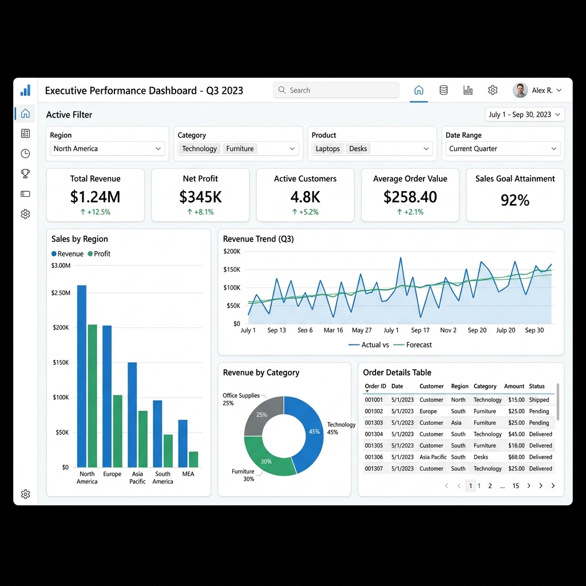

#  Datify AI – AI-Powered Business Intelligence & Analytics Platform

Datify AI is an AI-powered analytics platform that transforms structured datasets into actionable business insights using natural language queries, automated visualizations, analytics summaries, PDF reports, and Business Intelligence-ready exports compatible with Microsoft Power BI Desktop, Microsoft Excel, Tableau, and Python.

---

#  Features

*  AI-powered Natural Language Analytics using Llama 3 (Groq)
*  Multi-dataset CSV upload with automatic schema validation
*  Intelligent dataset merging with source tracking
*  Automatic interactive visualizations (Bar, Line, Pie Charts)
*  Business Intelligence dashboard with dataset quality overview
*  Analytics Summary generation
*  Power BI-compatible dataset export
*  AI-generated PDF analytical reports
*  Fast REST APIs built with FastAPI
*  Modern responsive UI built with React & Tailwind CSS

---

#  Business Intelligence Workflow

```text
CSV Upload
      ↓
AI Data Cleaning
      ↓
Data Processing
      ↓
Analytics Summary
      ↓
Export Analytics Dataset
      ↓
Power BI / Excel / Tableau
      ↓
Business Insights
```

---

#  Business Intelligence Features

* Dataset Quality Overview
* Analytics Summary
* CSV Export
* Business Intelligence Workflow
* Power BI-Compatible Dataset Export
* REST APIs
* AI-generated PDF Reports

---

#  Export Compatibility

The exported datasets are compatible with:

* Microsoft Power BI Desktop
* Microsoft Excel
* Tableau
* Python (Pandas)
* SQL-based Analytics Workflows

---

#  Power BI Screenshot

## Power BI Dashboard



---

#  Project Structure

```text
Datify_AI/
│
├── backend/
│   ├── main.py
│   ├── dataset_manager.py
│   └── ...
│
├── frontend/
│   ├── src/
│   └── ...
│
├── uploads/
│
├── reports/
│
├── powerbi/
│   ├── README.md
│   └── datify_analytics_export.csv
│
├── docs/
│
└── README.md
```

---

#  Tech Stack

| Layer                 | Technologies                        |
| --------------------- | ----------------------------------- |
| Frontend              | React, Vite, Tailwind CSS, Recharts |
| Backend               | FastAPI, Python                     |
| AI                    | Groq Llama 3, LangChain, FAISS      |
| Data Processing       | Pandas, NumPy                       |
| Machine Learning      | Scikit-learn                        |
| Business Intelligence | Power BI-Compatible CSV Exports     |
| Reporting             | ReportLab                           |

---

# Prerequisites

* Python 3.9+
* Node.js 18+
* Groq API Key

---

#  Installation

## 1. Clone the Repository

```bash
git clone https://github.com/Ndwi519/Datify_AI.git
cd Datify_AI
```

---

## 2. Backend Setup

```bash
cd backend
```

Create Virtual Environment

```bash
python -m venv venv
```

Activate

### Windows

```bash
venv\Scripts\activate
```

### Linux / macOS

```bash
source venv/bin/activate
```

Install Dependencies

```bash
pip install -r requirements.txt
```

Set Groq API Key

### Windows CMD

```bash
set GROQ_API_KEY=YOUR_API_KEY
```

### Windows PowerShell

```powershell
$env:GROQ_API_KEY="YOUR_API_KEY"
```

### Linux / macOS

```bash
export GROQ_API_KEY="YOUR_API_KEY"
```

Run Backend

```bash
uvicorn main:app --reload
```

---

## 3. Frontend Setup

```bash
cd frontend
npm install
npm run dev
```

Open

```text
http://localhost:5173
```

---

#  Example Questions

Ask questions like:

* Which region generated the highest revenue?
* Compare total profit by item type.
* Show units sold across all regions.
* Which dataset contains the highest sales?
* Show monthly revenue trends.
* Compare profit by country.

---

#  Analytics Summary

The Business Intelligence module automatically generates:

* Dataset Name
* Total Rows
* Total Columns
* Missing Values
* Numeric Features
* Categorical Features
* Dataset Quality Status
* Export Timestamp

---

# Report Generation

Datify AI automatically generates professional PDF reports containing:

* User Query
* AI-generated Insights
* Charts
* Analytical Summary

---

#  Future Enhancements

* Native Power BI Dashboard Embedding
* Scheduled Analytics Reports
* Cloud Deployment
* Multi-user Collaboration
* Interactive Dashboard Templates

